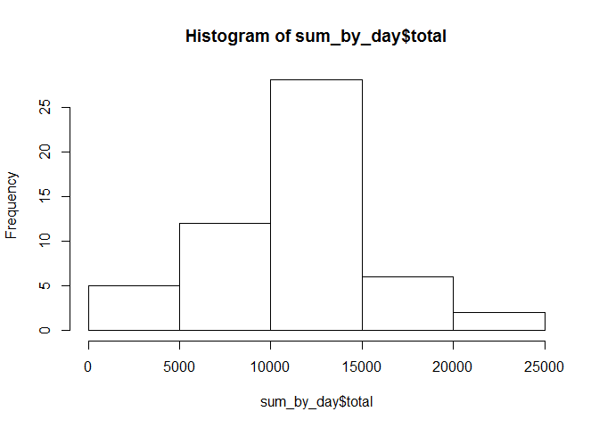
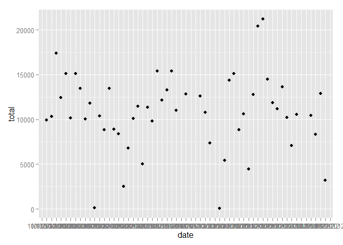
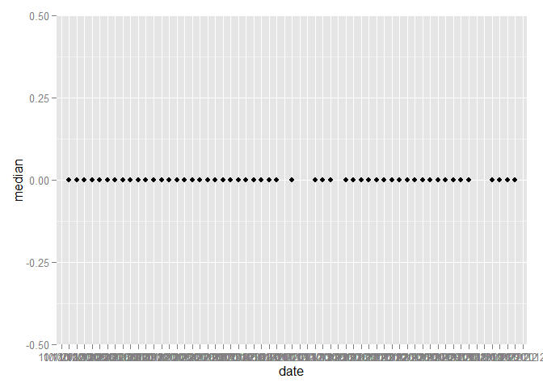
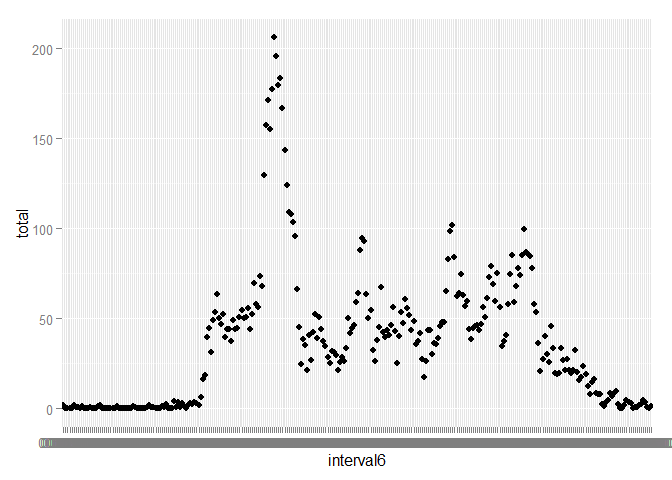
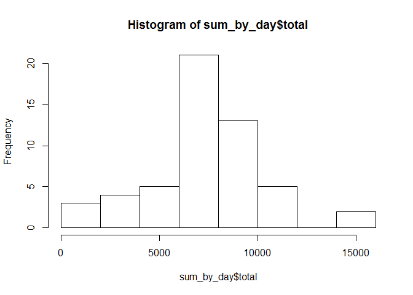
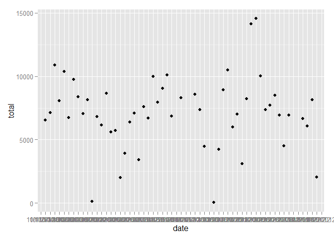
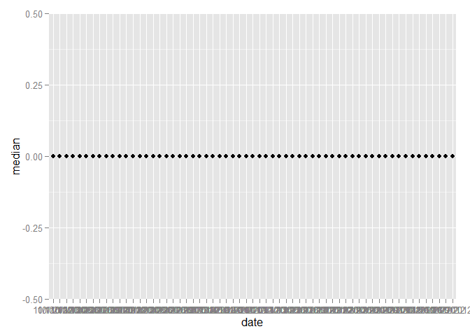

# Reproducible Research: Peer Assessment 1


## Loading and preprocessing the data
###Retrieve Data

The data are available at https://d396qusza40orc.cloudfront.net/repdata%2Fdata%2Factivity.zip

Download and place in your working directory


```r
  data<-read.csv("activity.csv")
```

###Examine the data

```r
  summary(data)
```

```
##      steps                date          interval     
##  Min.   :  0.00   10/1/2012 :  288   Min.   :   0.0  
##  1st Qu.:  0.00   10/10/2012:  288   1st Qu.: 588.8  
##  Median :  0.00   10/11/2012:  288   Median :1177.5  
##  Mean   : 37.38   10/12/2012:  288   Mean   :1177.5  
##  3rd Qu.: 12.00   10/13/2012:  288   3rd Qu.:1766.2  
##  Max.   :806.00   10/14/2012:  288   Max.   :2355.0  
##  NA's   :2304     (Other)   :15840
```

```r
  str(data)
```

```
## 'data.frame':	17568 obs. of  3 variables:
##  $ steps   : int  NA NA NA NA NA NA NA NA NA NA ...
##  $ date    : Factor w/ 61 levels "10/1/2012","10/10/2012",..: 1 1 1 1 1 1 1 1 1 1 ...
##  $ interval: int  0 5 10 15 20 25 30 35 40 45 ...
```

```r
  head(data)
```

```
##   steps      date interval
## 1    NA 10/1/2012        0
## 2    NA 10/1/2012        5
## 3    NA 10/1/2012       10
## 4    NA 10/1/2012       15
## 5    NA 10/1/2012       20
## 6    NA 10/1/2012       25
```

```r
  class(data)          # "data.frame"
```

```
## [1] "data.frame"
```

```r
  sapply(data, class)  # show classes of all columns
```

```
##     steps      date  interval 
## "integer"  "factor" "integer"
```

```r
  typeof(data)         # "list"
```

```
## [1] "list"
```

```r
  names(data)          # show list components
```

```
## [1] "steps"    "date"     "interval"
```

```r
  dim(data)            # dimensions of object, if any
```

```
## [1] 17568     3
```


```
## 
## Attaching package: 'dplyr'
## 
## The following object is masked from 'package:stats':
## 
##     filter
## 
## The following objects are masked from 'package:base':
## 
##     intersect, setdiff, setequal, union
```

```
## Warning: package 'ggplot2' was built under R version 3.1.3
```

```
## Warning: package 'scales' was built under R version 3.1.3
```

## What is mean total number of steps taken per day?

```r
  by_day<-group_by(data,date)
  sum_by_day<- summarise(by_day,total=sum(steps))
  hist(sum_by_day$total)  
```

 

### Find Mean

```r
  avg_by_day<- summarise(by_day,average=mean(steps))
  qplot(date,total,data=sum_by_day)
```

```
## Warning: Removed 8 rows containing missing values (geom_point).
```

 

### Find Median

```r
  middle_by_day<-summarise(by_day,median=median(steps,na.rm=TRUE))
  qplot(date,median,data=middle_by_day)
```

```
## Warning: Removed 8 rows containing missing values (geom_point).
```

 


## What is the average daily activity pattern?
###convert the interval to a valid time

```r
  data$Time<-strptime(str_pad(as.character(data[,3]),4,side="left",pad="0"),"%H%M" )
```

###Put the date and time together

```r
  digits4<-str_pad(as.character(data[,3]),4,side="left",pad="0")
  data$interval6<-paste0(substr(digits4,1,2),":",substr(digits4,3,4),":00")
  data$datetimeString<-paste(as.character(data[,2]), data$interval6)
  

df<-data[,c(1,5)]
df_grp<-group_by(df,interval6)
df_sum<-summarize(df_grp,total=mean(steps,na.rm=TRUE))
ggplot(df_sum,aes(interval6,total))+geom_point()
```

 

## Imputing missing values
###how many NA's are there

```r
  length(which(is.na(data[1])==T))
```

```
## [1] 2304
```

###Make a new dataset with a ZERO where a NA was in original

```r
  data2<-data[,c(1,2,3)]
  data2[is.na(data2[1,])==T,1] <- 0
```

###Histogram


```r
  by_day<-group_by(data2,date)
  sum_by_day<- summarise(by_day,total=sum(steps))
  hist(sum_by_day$total)  
```

 

### Find Mean

```r
  avg_by_day<- summarise(by_day,average=mean(steps))
  qplot(date,total,data=sum_by_day)
```

```
## Warning: Removed 8 rows containing missing values (geom_point).
```

 

### Find Median

```r
  middle_by_day<-summarise(by_day,median=median(steps,na.rm=TRUE))
  qplot(date,median,data=middle_by_day)
```

 

## Are there differences in activity patterns between weekdays and weekends?

